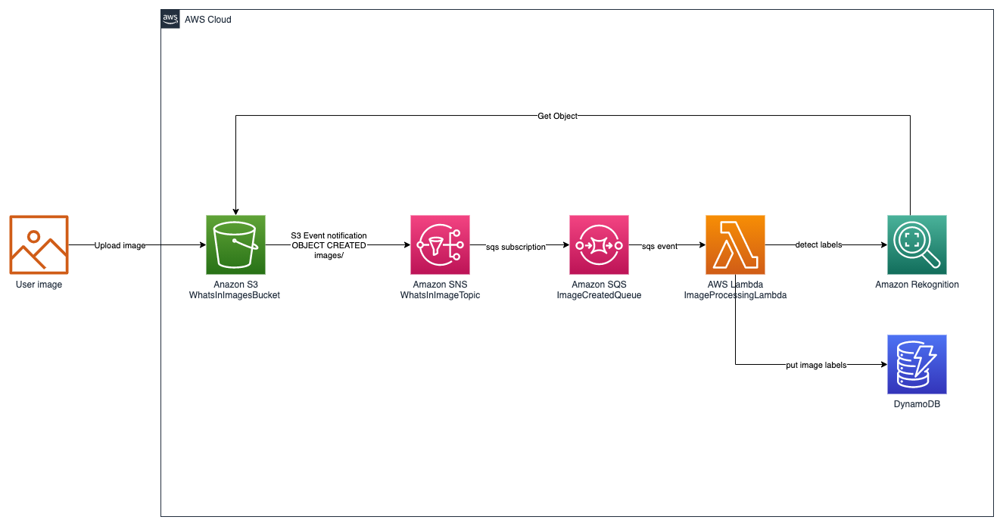
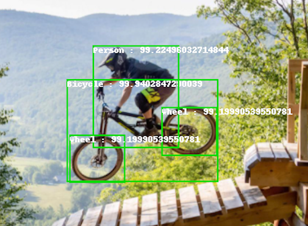
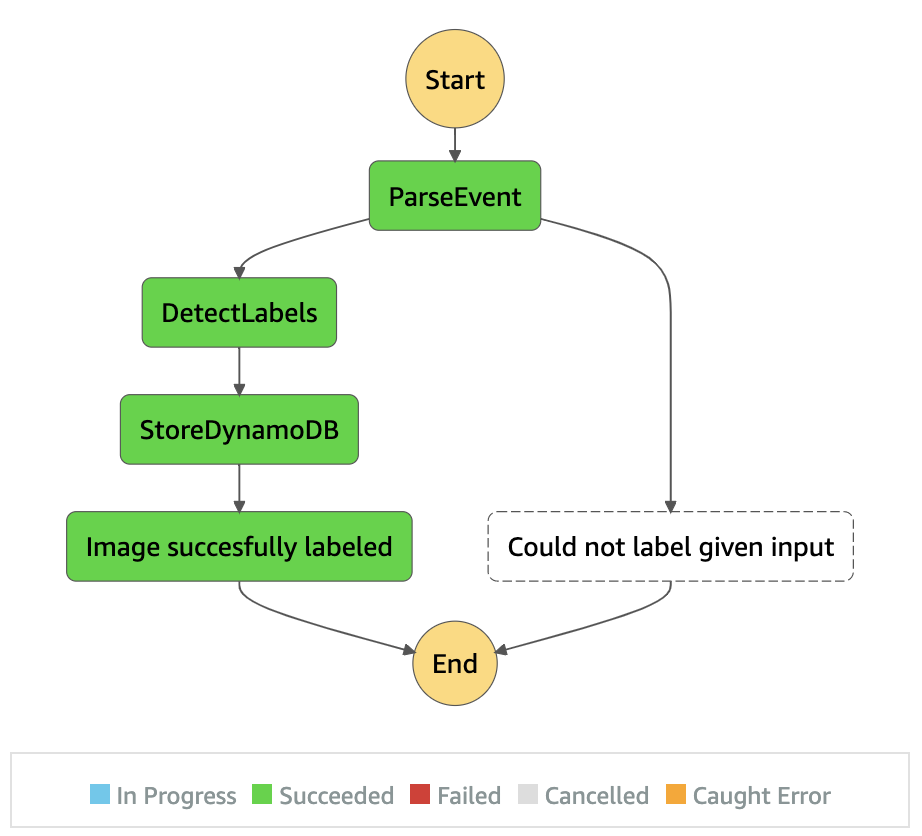

# Whats In Image

_Whats In Image_ is a service that labels picture content from uploaded images and
stores recognized image labels to database.

In addition to image labels, _Whats In Image_-service creates thumbnails for
uploaded images and draws recognition bounding boxes.

Todo example here

## Architecture


Images created S3 bucket will trigger pipeline where stored image is labeled with AWS
Rekognition. Acquired image labels are stored to the DynamoDB.

## Deployment

Todo how to setup the environment

## Development

Todo how to start the development

## Backlog

- [ ] unit tests
- [ ] integration tests
- [ ] region as parameter for lambda
- [ ] Step function instead of simple lamda
- [ ] Makefile
- [ ] Detect faces
- [ ] Create image thumbnail
- [ ] Bake images with rekognition bounding boxes and metadata
- [ ] Telegram bot interface
- [ ] CI/CD

## Log book

### 2021-05-18 Saving bb labeled image to s3 and adding unit tests

Added code to draw_bounding_box lambda for storing the image to S3. This worked nicely
with upload_fileobj api where you can store in memory file to S3. Seems to work with
local testing.

After this included test case that runs the lambda and checks that the labeled object
exists in the S3. There are no tests to check that the labels are correct. not sure how
this could be tested anyway.

Next thing is to start setting image resize, after that the statemachine should be ready.

### 2021-05-17 Bounding box drawing

+475 −153

1h 10min

Started implementing bounding box drawing logic to recognized images. Created new lambda
that draws the bb to the image together with label and confidence.

Got the basic drawing working by using Python Pillow library and following instructions
from AWS [tutorial](https://docs.aws.amazon.com/rekognition/latest/dg/images-displaying-bounding-boxes.html).
AWS tutorial was made for face detection, but it worked quite similar for object labels.



Also refactored unit tests so that each unit-test file presents separate step in the statemachine.

### 2021-05-16 Stepfunctions migration

Started migration process from a single fat lambda to stepfunctions state machine.
In this approach, the single lambda functionality is split to multiple lambas and their
execution is orchestrated with AWS Step Functions.



Visual feedback from the step function output is pretty nice, still having hard time to get proper developer experience. Local testing and getting the state machine working was quite painful.

### 2021-05-11

Continued with the unit tests and added assertions where dynamodb table is scanned after
running the unit test. The test will assert that lambda has inserted item to the local
dynamodb instance (mocked with moto).

Decided to start migrating the image*processing_lambda to a step function which will
have multiple stages. Initial thought is to have a pipeline that is triggered from S3
Create event. Then step function will run procedure \_parse event* -> _detect labels_ ->
create thumbnail -> create bounding box images -> store to metadata to DynamoDB. I was
was able to create the first lambda which extracts the bucket name and object key from
S3 event which is wrapped inside sqs event.

Also added Makefile for improved dev experience. I think it is good way to document
commands that are used during the deployment. Currently Makefile contains commands for
creation of venv, cleaning the venv, deployment and synth.

After removing the existing virualenv and trying to re-install the dependencies I end up
having problems from pip and installation failed. This was actually resolved by upgrading
pip. In the future it is a good practice to add upgrade pip command to the Makefile which
should use latest pip version before installing the requirements

```Makefile
$(VENV)/bin/activate: requirements.txt
	python -m venv ${VENV}
	./$(VENV)/bin/python -m pip install --upgrade pip
	./$(VENV)/bin/pip install -r requirements.txt
```

### 2021-05-10 Continue fixing unit tests

Today I will continue to setup the mock for Amazon Rekognition.
I just didn't find reasonable way of to mock the boto3 rekognition client. The need
would have been to mock this from the lambda code

```python
rekognition = boto3.client("rekognition")
```

Mocking this without touching other boto3 client became too complicated so I decided to
wrap the image labeling to a function `_detect_labels` which where internally using
Amazon Rekognition. This change made the test much more easier to mock as with this
change it is possible just to mock return value for the `_detect_labels` function which
was simple array. This could be done easily without any complex boto3 mocks, just Python
builtin unittest.mock can be used

```python
@pytest.fixture(scope="function")
def label_mock():
    with patch(
        "image_processor_lambda.image_processor_lambda._detect_labels"
    ) as mock_client:
        mock_client.return_value = {"Labels": []}
        yield
```

I think that the unit test saga is almost completed now, still have to create checks
that AWS Dynamodb contains a row and the content is reasonable.

### 2021-05-09 Fixing unit tests

Fixing the unit tests, currently the problem is that AWS services are not mocked
and local invokes will leak to real AWS endpoints from boto3. Lambda function uses
DynamoDB, S3 and Rekognition. Both DynamoDB and S3 can be easily mocked with moto but
Rekognition needs to be mocked with writing own mock function.

S3 and DynamoDB is now mocked but still having hard time to mock the Rekognition. It
seems to be little more complicated than expected to mock the rekognition and make sure
that only the rekognition is mocked, not anything else, this needs to be continued
